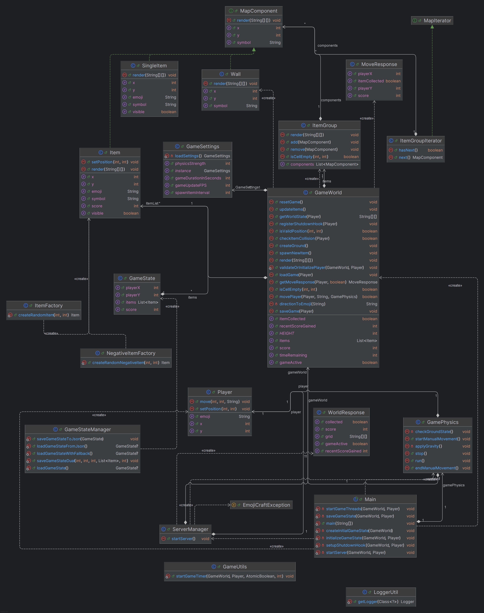

# EmojiCraft

**EmojiCraft** è un'applicazione Java SE progettata per simulare un gioco interattivo utilizzando emoji, esplorando concetti avanzati di programmazione orientata agli oggetti (OOP), design patterns e tecnologie Java.

---

## 🎯 Obiettivo del Progetto

L'obiettivo del progetto è sviluppare un'applicazione **ben strutturata, sicura e manutenibile**, che dimostri:
- Utilizzo della **programmazione orientata agli oggetti**.
- Implementazione di **pattern di progettazione**.
- Uso delle principali tecnologie Java.
  
Il progetto pone particolare attenzione alla **sicurezza del codice** e a una corretta gestione delle eccezioni.

---

## 📄 Requisiti Raggiunti

### **Design Patterns obbligatori (16 punti)**

1. **Factory**  
   - **Implementazione**: `ItemFactory` e `NegativeItemFactory` gestiscono la creazione dinamica di oggetti di gioco come emoji positivi e negativi.  
   - **Uso**: Factory Pattern permette di creare nuovi oggetti in posizioni casuali sulla griglia, semplificando l'estendibilità.  

2. **Composite**  
   - **Implementazione**: `ItemGroup` è utilizzato per rappresentare gerarchie di oggetti di gioco.
   - **Uso**: Il Composite Pattern permette di combinare diversi oggetti sulla griglia, trattandoli come un singolo componente.

3. **Iterator**  
   - **Implementazione**: `MapIterator` è utilizzato per iterare attraverso gli elementi sulla griglia di gioco.
   - **Uso**: Consente di attraversare i componenti della mappa secondo una logica predefinita.

4. **Exception Shielding**  
   - **Implementazione**: `EmojiCraftException` garantisce una gestione robusta delle eccezioni.  
   - **Uso**: Tutte le eccezioni sono catturate e schermate per evitare crash o stack trace visibili all'utente. Logging avanzato è eseguito con `LoggerUtil`.

---

### **Tecnologie obbligatorie (14 punti)**

1. **Collections Framework**  
   - **Uso**: Ampio utilizzo di `List`, `Map` e `ConcurrentHashMap` per mantenere strutture dati flessibili e thread-safe.  
   - **Esempio**: Gli oggetti di gioco vengono gestiti in una lista (`ItemGroup`).

2. **Generics**  
   - **Uso**: Generics sono utilizzati per scrivere codice flessibile, specialmente per le collezioni.  
   - **Esempio**: `ItemGroup` utilizza Generics per gestire componenti di tipo `MapComponent`.

3. **Java I/O**  
   - **Implementazione**: La persistenza del gioco utilizza I/O binario e JSON attraverso `GameStateManager`.  
   - **Esempio**: Lo stato del gioco è salvato in `game_state.dat` e `game_state.json`.

4. **Logging**  
   - **Implementazione**: Logging avanzato tramite `LoggerUtil`, che scrive eventi del gioco su `game_logs.log`.  
   - **Esempio**: Il sistema registra eventi significativi come il riavvio del gioco e la fine del timer.

5. **JUnit Testing**  
   - **Implementazione**: Sono presenti test unitari parziali per le classi principali, come `GameStateManagerTest` e `PlayerTest`.  
   - **Limitazione**: Non è ancora presente una suite completa di test JUnit.

---

### **Requisiti di Sicurezza**

1. **Nessuna eccezione non gestita**  
   Tutte le eccezioni sono catturate e gestite nel codice. Nessun crash o stack trace visibile all'utente. ✅  

2. **Nessun dato sensibile hardcoded**  
   Tutti i parametri configurabili (es. durata del gioco, spawn degli oggetti) sono definiti in `GameSettings.json`. ✅  

3. **Sanificazione dell’input utente**  
   La gestione degli input lato server non è completamente sanificata, lasciando potenziali margini di miglioramento con input inesperti o intenzionalmente errati.   

4. **Propagazione controllata delle eccezioni**  
   Propagazione centralizzata attraverso eccezioni personalizzate (`EmojiCraftException`). ✅  

---

## ⚙️ Setup ed Esecuzione

### Prerequisiti
- **Java SE 17+**
- **Maven 3.6+**

### Istruzioni
1. **Clona il progetto**
   ```bash
   git clone https://github.com/PACIN00B/emojicraft
   cd emojicraft
   ```

2. **Compila ed esegui**
   ```bash
   mvn clean compile
   mvn exec:java -Dexec.mainClass=Main
   ```

3. **Avvia il front-end**
   - Apri il browser e vai su `http://localhost:4567`.

---

## 🎮 Comandi del Gioco

- **Movimento del giocatore:** `W`, `A`, `S`, `D`.
- **Riavvia il gioco:** Tramite pulsante *Restart*.
- **HUD:** Visualizza punteggio e timer.

---

## 📊 Diagrammi UML

### Diagramma delle Classi


### Diagramma dell'Architettura
- Il server Spark comunica con il front-end tramite REST API per sincronizzare griglia, punteggio e timer. 
- La logica di gioco è gestita nel back-end (Java), mentre l'interfaccia grafica è generata in HTML/CSS/JavaScript.

---

## 🐞 Limitazioni Note

1. **Sanificazione degli input**  
   Attualmente non è implementata una gestione approfondita degli input lato server.

2. **JUnit Testing incompleto**  
   La suite di test non copre tutte le funzionalità.

3. **UI Limitata**  
   Interfaccia utente semplice basata su HTML/CSS; migrazione a Swing o JavaFX potrebbe migliorare l'esperienza, non è stato possibile a causa delle emoji non supportate correttamente da JavaFX.

4. **Persistenza migliorabile**  
   Salvataggio dello stato basato su file JSON e binario, senza supporto per database.

---

## ✨ Possibili Miglioramenti

1. **Ampliare la suite di test JUnit** per raggiungere una maggiore copertura.
2. **Rafforzare la sanificazione degli input** per una maggiore sicurezza lato server.
3. **Migliorare l’UI** usando framework avanzati come JavaFX.
4. **Aggiungere una gestione degli utenti** per consentire sessioni di gioco personalizzate.

---

## 📬 Contatti

Per segnalazioni o supporto:
- **Email:** contact@brunostano.com

---

© 2025, Bruno Stano  - Tutti i diritti riservati.